<div align="center">



<br/>

[](https://git.io/typing-svg)

<br/>


[](https://linkedin.com/in/ananyamittal2000)
[](mailto:ananyamittal88@gmail.com)
[](https://ananyaontheshor.github.io)


</div>

<br/>

```
// profile.load()

currently  →  data analyst and PM candidate. also building things with Claude AI.
building   →  NyayaAI — legal research across 3 crore+ Indian court judgments
also me    →  poet · photographer · painter · strong opinions about em dashes
fun fact   →  wrote poetry publicly before writing code publicly.
              the audience was kinder then.
```

<br/>

```
// stack

languages  →  Python · SQL · TypeScript
analytics  →  Power BI · Tableau · sklearn · pandas
building   →  Claude AI · React · Express · multi-agent systems
```

<br/>

<div align="center">


</div>

<br/>

**[⚖️ NyayaAI](https://nyayaai.up.railway.app)**

```
multi-agent platform · 3 crore+ Indian court judgments · real-time search

searches Indian case law via IndianKanoon API. compliance checks,
contract review, multi-agent architecture. built with Claude AI.

React · Express · Claude AI · IndianKanoon API
```

**[🎮 SideQuest](https://sidequest-game.up.railway.app)**

```
personal game tracker · multi-platform · RAWG API

tracks what you're playing, what's abandoned, what's next.
built because spreadsheets are a bad way to manage a backlog.

FastAPI · Jinja2 · PostgreSQL · Railway
```

**[📦 MSME Churn Prediction](https://github.com/ananyaontheshor/msme_churn_prediction)**

```
logistic regression · 9,500+ records · Tata nexarc internship data

SLA non-compliance was the silent churn driver hiding behind pricing complaints.
the model found what the dashboards weren't showing.

Python · sklearn · Power BI · cohort modelling
```

**[📚 Kindle Discoverability](https://github.com/ananyaontheshor/kindle-discoverability-analysis)**

```
133,102 listings · EDA · marketplace analysis

KU titles get 5× more bestseller placement and 25× more reviews.
price doesn't drive discoverability. the algorithm does.

Python · Pandas · Tableau
```

<br/>

<div align="center">

```
▌ ananyaontheshor · open to collabs and full-time roles · ping me
```

*// made with data · law · and a lot of caffeine //*

</div>
